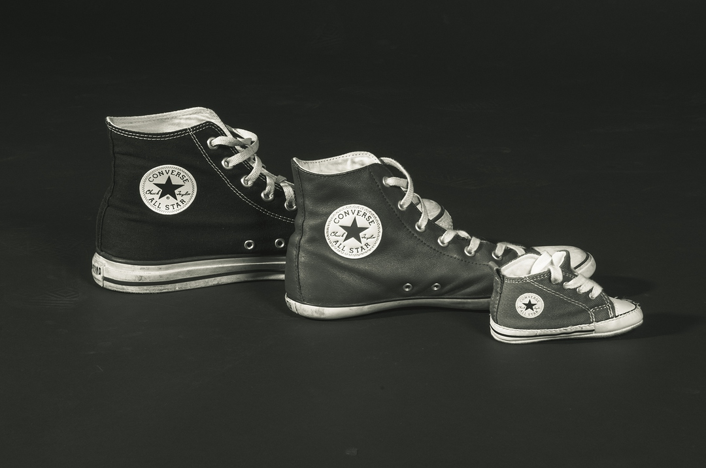

## Tackling legacy code with mob programming and Lego

### *Joe Wright*
#### __@joe_jag__

---

---

---

---

---

---

---

# Mob Programming

---

---

> All the brilliant people working on the same thing, at the same time, in the same space, and on the same computer
--Woody Zuill

---

---

---

---

# Timer

* 7 Minutes each - then rotate
* The person at the keyboard is a typist

---

> For an idea to go from your brain to the computer, you have to use someone elses hands
--Llewellyn Falco.

---

# Strong-style pairing

* Know what example the mob is solving
* Speak at the right level of abstraction
* The typist has to trust their navigators

---

# Ideal Size

---

# Safety

### *We made a commitment to treat each with kindness, respect and consideration*

---

## But Why?

---

# But Why?

* Higher productivity
* Better quality software
* Get things done

---

## How can I get started?

---

# The Mobbing Working Agreement

* Gather your team around a co-working space
* Limit your work in progress to one item
* Commit to creating a safe environment
* Turn up the good

---

---

---

---

---

---

---

---

# Statistics - 2016

|            | *Planned* | *Failure* | *Ad-hoc* | *Meetings* |
| ---        | ---     | ---     | ---    | ---      |
| __April__  | 23%     | 30%     | 40%    | 2%       |

---

# Statistics - 2016

|                | *Planned* | *Failure* | *Ad-hoc* | *Meetings* |
| ---            | ---     | ---     | ---    | ---      |
| __April__      | 23%     | 30%     | 40%    | 2%       |
| __November__   | 56%     | 4%      | 24%    | 10%      |

---

---

# Micro Retro

---

# 10% Days

---

# Technical Debt

---

## __How__ to tackle a legacy code situation

---

# I don't know

---

> I know it might not work. But let's try it and see what happens. Let's not throw out the idea before it even has a chance. Let's run the experiment
--Rich Sheridan

---

## *There's only one way to find out:*
# Run the experiment

---

# What are your questions?

### __@joe_jag__ - *Joe Wright*
#### https://github.com/joejag/talk-mob\_programming\_and\_lego
